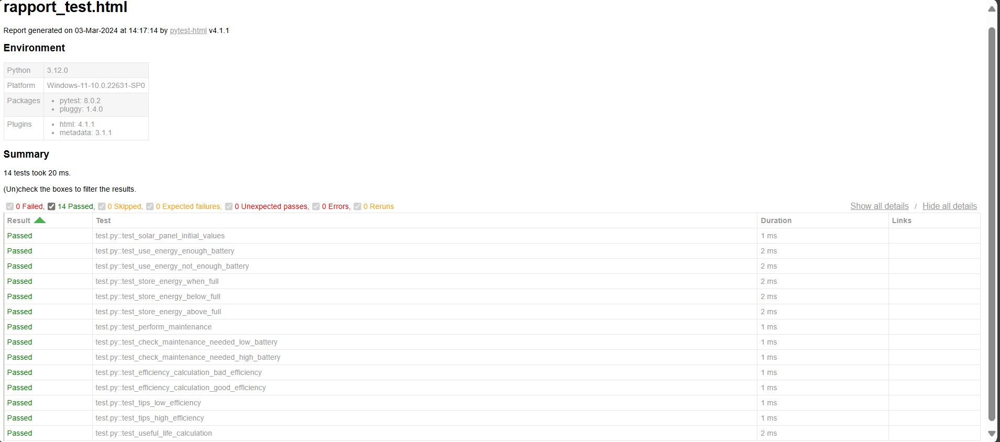

# Solar Panel

Solar panel is a simple python project whose goal is to  
launch an innovation on solar panel by adding a battery 
extension. Our goal was to implement this solution in Python,
subject to 02 constraints:

- We should limit the bug cost and ensure ease of 
maintainability by using unit tests.
- TDD methodology is mandatory when adding a new feature


## Features
the project's main features 
```text
1. Add a solar panel
2. Use energy of a solar panel
3. Store energy of a solar panel
4. Calculate efficiency of a solar panel
5. Check maintenance of a solar panel
6. Calculate efficiency of a solar panel
```
## Tests and Code quality

### Test
all features are covered by tests while 
respecting the TDD methodology 

- Write tests first
- write the minimum amount of code (to make the test pass)
- Refactor the code
- Repeat

thanks to the pytest library, we can generate a report of 
all the tests performed

```code
pytest --html=report.html
```
This command runs the tests and generates a report.html 
file in the current directory.


### Code quality
To ensure code quality, we used several python tools

- PEP8 (python enhancement proposal)
- pylint (linter)
- Black (code formatter)
- Bandit (static analysis)


